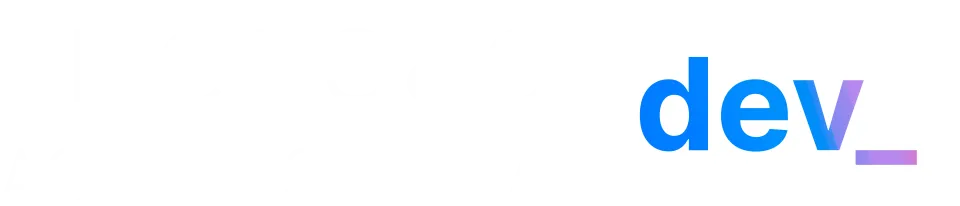
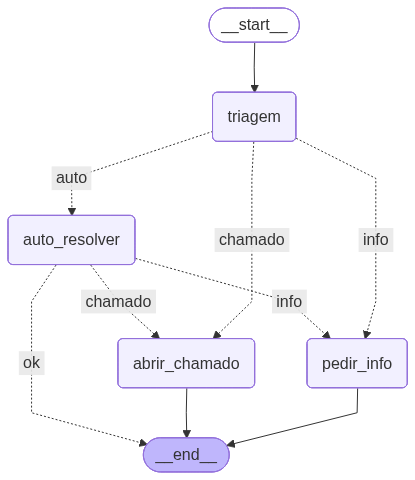

# Imersão Dev Agentes de IA Google



<br/>

`#imersao-agentes-ia-google`

## Introdução

Nessa imersão da Alura, que ocorreu entre 9 e 11/09/2025, implementamos um agente de IA que responde usando RAG (uma base de conhecimento própria, retirada de uma leitura de arquivos .pdf).

A partir da pergunta do usuário, ele pode tomar as seguintes decisões:
- Auto resolver: responde o usuário com sucesso.
- Abrir chamado: encaminhar a pergunta para outro setor (RH, por exemplo).
- Pedir informações: pede para que o usuário esclareça melhor algum ponto específico.



## Tecnologias utilizadas
- Python
- Gemini
- Google Colab (opcional)

## Rodando no Google Colab
É necessário adicionar sua chave api Gemini para iniciar o programa. Deve se ir na aba Secrets, adicionar novo secret, nomear como 'GEMINI_API_KEY' e inserir o valor da chave.

Para que o Google Colab tenha acesso aos pdfs, deve ser feito o upload na plataforma pela aba "Arquivos". Os pdfs utilizados estão na pasta '/arquivos' desse repositório.

## Rodando localmente
Para iniciar o programa localmente, deve-se instalar a dependência para o Python Notebook:

```
pip install --upgrade ipykernel
```

Dependendo, deve ser necessário iniciar um ambiente virtual primeiro. Caso esse for o caso, esse comando deve ser usado antes do anterior:

```
# instala e inicia o ambiente virtual
python -m venv .venv
source .venv/bin/activate
```

Além disso, deve ser criado um arquivo .env seguindo a estrutura do arquivo '.env.example', onde estará guardada a chave da API.
